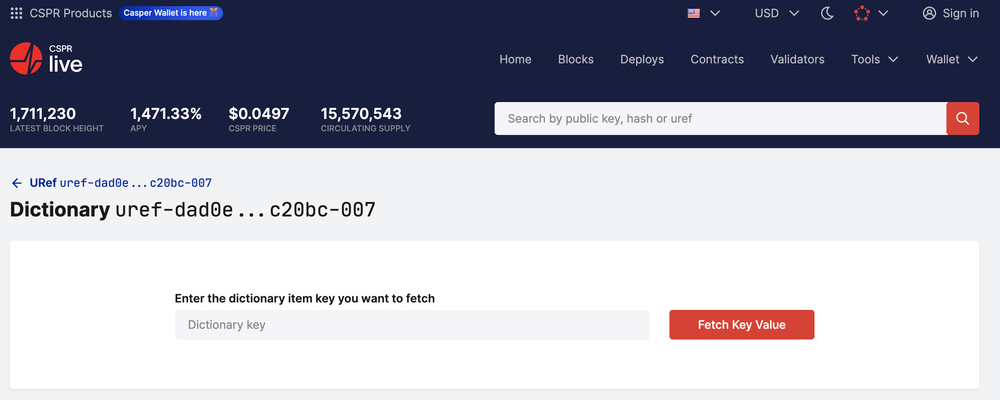
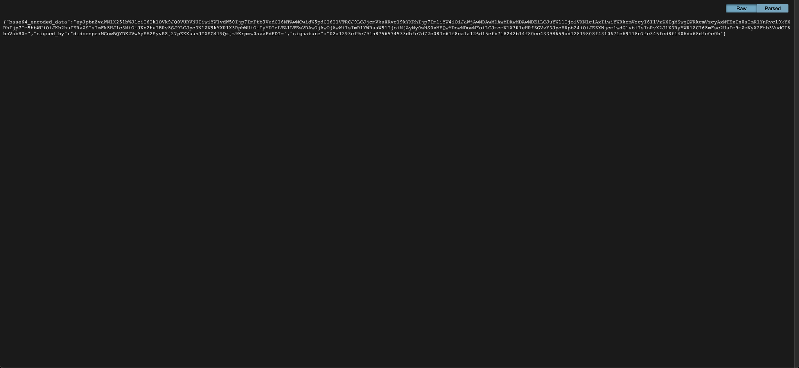

# Milestone 3: Smart Billing Platform Prototype

Table of Contents
-----------------

1. [Background Information](#background-information)
    1. [Context](#context)
    2. [Summary of Core Requirements](#summary-of-core-requirements)
    3. [Fulfillment of Core Requirements](#fulfillment-of-core-requirements)
4. [Use Case Instructions](#use-case-instructions)
   5. [Login, Authoriztation & Account Procedures](#login-authoriztation--account-procedures)
   6. [Invoice Verification](#invoice-verification)
   7. [Smart Billing](#smart-billing)
   8. [Invoice Tokenization](#invoice-tokenization)
3. [Technical Documentation](#technical-documentation)
    1. [Architecture Description](#architecture-description)
   2. [Casper DID Contract Creation](#casper-did-contract-creation)
    3. [Casper Smart Contract Setup](#casper-smart-contract-setup)
    4. [Local Installation Instruction](#local-installation-instructions)

# Background Information

This repository completes the requirements set forth in milestone 3 of the [DevXDao Grant #645](https://portal.devxdao.com/public-proposals/645)
It relies on work done during [Milestone1](https://github.com/NoumenaDigital/sbp-dxd-m1) and [Milestone2](https://github.com/NoumenaDigital/sbp-dxd-m2).

The prototype relies on the Noumena off-chain smart contract platform and integrates with a on-chain Casper Smart Contract for DID based delegation rights 
and IPFS for making invoices verifiable through independent parties. 

## Context

In the scope of this project, a prototype of a Smart Billing Platform that provides invoice verification, liquidity to invoice 
trading market and debtor rating is being implemented. This platform utilizes off-chain smart contracts implemented in the 
Noumena Protocol Language (NPL) to handle complex business logic and sensitive data. These off-chain smart-contracts are 
used to orchestrate an on-chain smart contract which controls actions on the Casper blockchain itself e.g. add DID, change 
owner, etc.

For Milestone 3, a single prototype integrating all 3 use cases into a combined Smart Billing Platform (SBP) was developed. The submission includes 
a fully functional user interface and a bridge to the Casper blockchain that leverages the DID smart contract from [Milestone 2](https://github.com/NoumenaDigital/sbp-dxd-m2) 
to delegate the right for the signing of invoices from the supplier to the Smart Billing Platform. 

For a detailed description of the user journeys and the solution architecture overview, please refer to [Milestone1](https://github.com/NoumenaDigital/sbp-dxd-m1) of this 
grant. The integration of a rating DAO will be handled in Milestone 5 and the connection to the ACTUS standard and a tokenization of invoice
through that standard will be provided in Milestone 6.

The User Journeys covered in the SBP address the following 3 problems:

### 1. Invoice Fraud
Today, invoices are usually sent as PDFs or UBLs via email or via a web platform, which, however, is subject to increasing
fraud. This has become a serious issue over the last years and individuals and companies lose hundreds of millions to billions 
of euros per year due to fake invoices in the Netherlands alone.

### 2. Lack of clarity and transparency for underlying contracts
The lack of clarity about invoices poses challenges in debtor management and collection. Often, there are
disputes, e.g., about whether a invoice is due for payment or whether the deliverables as specified in the
underlying contracts between the creditor and the debtor have been properly delivered. The lack of clarity about invoices 
leads not only to significant inefficiencies in debtor management and collection due to the frequent manual interventions, 
but also to unsatisfactory client experiences.

### 3. Illiquid trade finance markets
Liquidating invoices is a long-winded process and often requires complex and expensive refinancing through
banks. The valuation and risk assessment which are necessary to facilitate the trading of invoices require
specialized knowledge. Contracts for these trades are complex and usually not standardized. All this
results in an illiquid market.


## Summary of Core Requirements

Milestone 3 aims to provide a fully functioning prototype including a user interface and API which addresses the 3 problems outlined above.
While the prototype will not include any integrations into legacy systems, it will take advantage of smart contracts on the Casper blockchain 
and the IPFs decentralized data storage.

Even though ne could in principle build 3 separate tools to address the above problems, the aim is to build a single solution that addresses 
all above issues in a single platform.

The grant requires the creation of a couple screens for the prototype. This repository exceeds that requirement and provides a fully functioning prototype with a UI that covers alls 3 user stories.

## Fulfillment of Core Requirements

The operators of the SBP ensure the trust in the participants of the SBP, by conducting a due diligence of the participants in the onboarding process.
The trust between the participants and between the participants and the receivers of invoices is thus rooted in the trust in the operators of the Smart Billing Platform.

The platform caters to both B2C use cases through a user interface and B2B use cases through the API specified in the openapi definition.
Detailed instructions on testing the prototype through the UI are provided in the section [Use Case Instructions](#use-case-instructions). 
It also specifically highlights the usage of the API for the invoice verification usecase. 

The backend and UI prototype developed, follows the user journeys described in [Milestone 1](https://github.com/NoumenaDigital/sbp-dxd-m1). The prototype contains the connector to the Casper 
blockchain.

The Smart Billing Platform prototype which is contained within this repository addresses the above problem statements in the following way:

### 1. Invoice Verification Engine
Suppliers can upload invoices in the form of a [Universal Business Languages (UBL)](https://www.oasis-open.org/committees/tc_home.php?wg_abbrev=ubl) 
file to the Smart Billing Platform. The Platform then structures each submitted 
invoice in the form of a smart contract between the supplier of the invoice and the Smart Billing Platform on the Noumena Platform and furthermore
makes each invoice in the form of a signed and encoded JSON available on [IPFS](www.infura.io). 

Recipients of the invoice can then upload the same UBL file, which they receive through some electronic format from the supplier, 
directly to the API of the system or through the user interface which is publicly available through `/verify-invoice` on the platform. 
The system compares the uploaded invoices to its records based on the invoice values and informs the recipient whether the invoice is known to the system 
and all values coincide with the values submitted by the original supplier. 

For an additional level of trust and security, recipients can also compare the invoices directly to the immutable record of the invoices provided on IPFS.
For which the supplier can pass along the link to the IPFS record to the receiver together with the bill.

The DID management smart contract from [Milestone 2](https://github.com/NoumenaDigital/sbp-dxd-m2) is used to delegate the right to sign and 
upload the invoice to IPFS for this and all subsequent use cases. For more details on this smart contract see the following 
[README file](casper/README.md).

### 2. Smart Billing Engine

Modeling invoices as Smart Contracts (“Smart Bills”) can overcome many of the challenges regarding the intransparency of invoices 
and underlying contracts in debtor management: Smart Bills can contain the full data and logic required to validate and process 
invoices, providing the required transparency. Smart Bills are self-contained and - whilst derived - independent of the original 
contracts such that they can be processed by third parties without needing to know the details about underlying agreements that 
have been established between the counterparties in the past. Automated smart contracts that are aware of the underlying delivery 
by being integrated into logistics and ERP systems, can trigger payments whenever specific events (Milestones) within the logistics chain occur.
This is possible even whilst sharing the minimal necessary private data through usage of DIDs, stored on an enterprise grade 
public blockchain like the Casper chain.
 
For this prototype, contracts and their milestones were modelled within the smart contracts of the Noumena Platform. Whenever a milestone is reached, 
invoices are automatically created and placed on IPFS for the verification through Use Case 1: Bill Verification

Given the highly individual and customized nature of milestones, the conditions to meet a milestone and the respective connectivity to 
IoT sensors such as GPS sensors are reserved for the implementation of an MVP of this solution. The implemented smart bills incorporate various logical 
checks, such as the completeness of milestones compared to the overall value of the contract and various date time related conditions. 

### 3. Bill tokenization and factoring

A secondary market for the trading of invoices has been created. Bills that are uploaded to the system by the supplier or that 
have been created by the smart contracts from the 2nd Use Case Smart Billing, can be offered on a Marketplace to potential investors.
Upon purchasing these invoices, the ownership of the specific invoice is transferred to the buyer and the buyer now owns the debt 
represented by the invoice towards the original recipient of the invoice. 

Through the use of the [Nucleus Finance](https://nucleusfinance.com/) platform, described in [Milestone 5]((https://portal.devxdao.com/public-proposals/645)) 
of this grant these invoices will be tokenized and made tradeable on the Casper blockchain itself. This prototype creates the foundation
for that marketplace. 

The tokenization of invoices has the potential to disrupt today’s supply chain finance markets - and thus trade financing as a whole.

Equipped with this prototype, we will conduct a pilot with a large invoice management and debt collection business with the aim of
bringing the aforementioned solutions to the real world.


# Use Case Instructions

For the purpose of reviewing the prototype submitted in this milestone, a review environment has been set up.
It is also possible to install the prototype locally, but this will require a Noumena Platform License. 

The review environment can be reached as follows:

| Area | address                                                       |
|------|---------------------------------------------------------------|
| UI   | https://app-sbpdxd-m3.shared-dev.noumenadigital.com/login     |
| API  | https://api-sbpdxd-m3.shared-dev.noumenadigital.com           |
| Swagger | https://api-sbpdxd-m3.shared-dev.noumenadigital.com/swagger   | 

The respective links for a local installation are as follows:

| Area    | address                        |
|---------|--------------------------------|
| UI      | http://localhost/login         |
| API     | http://localhost:8080          |
| Swagger | http://localhost:8080/swagger/ |

## Login, Authoriztation & Account Procedures

The current prototype has 3 users built in:

| User  | Local Password | Review Environment Password | Account Hash                                                     |
|-------|----------------|-----------------------------|------------------------------------------------------------------|
| user1 | sbp            | devxdao                     | d6c48c5c2378e30905bb7916cde5fe5fcae082a0e3eb5093d7435cc7c800bee7 |
| user2 | sbp            | devxdao                     | 12d91f30f0bc5dbc7d859040f1bd54a9cc2f76fdfa1bee42b0ca92eeed312eb2 |
| user3 | sbp            | devxdao                     | 4af7048197bc3f13f8be2d705335f9a291a0905cb0d2505d87962e8ed5aa5dab |

The description for the API interfaces can be found in the [OpenaAPI Definition](src/main/resources/openapi.yml).

### Obtaining an Authentication Token via the API

To submit an Invoice via the API, one first has to obtain an Bearer Auth Token from the platform. This can be achieved by querying the /nova/auth/login endpoint with a curl command in the terminal as follows:

```bash
curl --location --request POST 'https://api-sbpdxd-m3.shared-dev.noumenadigital.com/sbp/auth/login' \
--header 'Content-Type: application/x-www-form-urlencoded' \
--data-urlencode 'username=user1' \  
--data-urlencode 'password=devxdao' \
--data-urlencode 'grant_type=password' \
--data-urlencode 'client=sbp'
```
This will provide a response that looks as follows

```bash
{
"access_token": string,
"expires_in": int,
"refresh_token": string
}
```

With the access token being quite a long string. Please store the access token to continue with the steps of submitting an invoice and verifying it.

After the time given in `expires_in` (currently 5 min) the token will no longer be valid and you will need to renew the token.

### Login & Account Data in the UI

To log in, navigate to the test review environment mentioned in the table above.
For simplicity, `user1 is used throughout the instructions, unless mentioned otherwise.


Once logged in, you can navigate to the account page by clicking on the username in the top right corner.


By following the link under **Casper Account Details** you can visit the Casper account page, where you will see the last action 
being adding a delegate right to the Casper DID Management Smart Contract. 


### Verify delegate rights on the DID Mgmt Smart Contract on Casper

One can also verify the delegate rights from the Casper Smart Contract itself. To do this, do the following:

1. Navigate to the DID contract's [delegates dictionary](https://testnet.cspr.live/dictionary/uref-dad0e33a90579308c624e66433c53edac2cd4bc88b7ecd1d18155fb7e85c20bc-007)  
   
2. Given a user's account-hash (see table above in [Login, Authoriztation & Account Procedures](#login-authoriztation--account-procedures), e.g. `user1`'s is `d6c48c5c2378e30905bb7916cde5fe5fcae082a0e3eb5093d7435cc7c800bee7`), search for this in the dictionary.  The result should show that the `SBP` account-hash (`e5e3607a0925a715429f08d12e82bcf8f996b8113857034fff8a66a067ddd3b3`) is a delegate of the `user1` account.
   
   
)
3. This result affirms that trust has been placed in the delegate account (`SBP`) by the DID owner account (`user1`)

The affirmation of the delegate right on through the smart contract is an essential part to the logic of the platform.

## Invoice Verification

To verify an invoice through the SBP platform, the user submitting the invoice (supplier) first needs to delegate the right to 
sign the invoice to the SBP. This is done through the Casper DID management smart contract and the method for affirming it is 
outlined in the section above. 

Invoice verification can be done via the UI or the API. Through the API, pre-existing UBL files can be verified. Through the UI, 
invoices can directly be entered into the system. 
To facilitate the review process, we have provided instructions on how to do submit an invoice through the UI by hand, while also
providing some files that can be submitted via the API to simplify the verification process and ensure that the dat submitted for
invoice registration matches the data used for verification. 

REVIEWED TILL HERE - Mention in Fullfillment how it addresses the above issues

### Invoice submission using the UI portal

1. To create a new invoice first log in and then go to the invoices overview page and click on ”Add New Invoice”.
   
2. Enter all necessary data with regards to the invoice number, the amount and the deadlines.
   
3. You will be asked whether you want to trade this invoice, click No to stick with the invoice verification use case instead of the invoice tokenization use case.
   
4. The Creditor/Supplier has been pre-defined. Enter the customer details and click on “Create Invoice”. At this point, the invoice will actually be created in the system.
   
5. You will be shown a detailed overview page of the specific invoice.
   
6. By clicking on BLOCKCHAIN REF, you will be forwarded to the IPFS repesentation of the invoice.
   
7. By clicking on Invoices in the left nevigation menu, you will see the new invoice having been added to the system.
   

### Invoice submission using the API

The same can also be achieved via the api. For the purpose of reviewing the verification mechanism, an api request is provided below
which will inject an invoice into the system against which the verification process can then be run with the two provided files.

Invoice submission request (replace TOKEN_STRING with the bearer token from above):

```bash
curl --location --request POST 'https://api-sbpdxd-m3.shared-dev.noumenadigital.com/sbp/api/v1/invoices' \
--header 'Content-Type: application/json' \
--header 'Authorization: Bearer TOKEN_STRING' \
--data-raw '{
  "invoiceNumber": "F2209840543",
  "amount": {
    "amount": 112.50,
    "unit": "EUR"
  },
  "creditorData": {
        "iban":"ZZ0000000000000001",
        "name":"User 1",
        "address":"User 1, Address 1111"
  },
  "debtorData": {
        "name" : "Debtor",
        "address" : "Debtor 1, Address 11111"
  },
  "issueDateTime": "2025-05-09T13:33:30.413Z",
  "deadline": "2025-05-09T13:33:30.413Z",
  "freeTextDescription": "description",
  "toBeTraded": false
}'
```

### Invoice verification using the UI and a UBL file

1. Visit the verification portal at:
https://app-sbpdxd-m3.shared-dev.noumenadigital.com/verify-invoice

   
2. Upload the UBL file that was provided by the supplier to the portal and click “Verify”
   
3. If the file is correctly formatted and the respective invoice has been registered with the Smart Billing Platform, the portal will confirm the authenticity of the invoice
   
4. Otherwise, the portal will fail the verification process
   

To verify using the UI, we have provided two files, where the correct file corresponds to the invoice uploaded via API above and the incorrect one has the IBAN and user name changed.

[Correct UBL File](docs/reviewInstructions/correct_verification_UBL.xml)

[Incorrect UBL File](docs/reviewInstructions/incorrect_verification_UBL.xml)

### Invoice verification using the API

To verify using the API, the above files need to be base64 encoded. The content can then be uploaded via an API request as follows:

```bash
curl --location --request POST 'https://api.nova- dev.noumenadigital.com/nova/api/v1/invoices/verify' \
--header 'Content-Type: application/json' \
--data-raw '{
    "type" : "xml",
    "base64EncodedFile" : "FILE_CONTENT"
}
‘

```
Here `FILE_CONTENT` needs to be replaced with one of the following files:

[Correct Base64 UBL File](docs/reviewInstructions/correct_verification_UBL_Base64.xml)

[Incorrect Base64 UBL File](docs/reviewInstructions/incorrect_verification_UBL_Base64.xml)

## Smart Billing

The Smart Billing Contract underlies a set of milestones and ensures that invoices are generated when and only when certain
conditions are met.

Contracts can be created and milestones can be completed via the UI or the API. This section will demonstrate the UI. For the API,
the description of the interfaces can be found in the [OpenaAPI Definition](src/main/resources/openapi.yml).

1. To create a new contract, go to the contract overview page and click on ”Add New Contract”.
   
2. Enter the Contract Details and proceed to the next page.
   
3. The supplier data will be prefilled to be equivalent to the user data. Fill in the customer details and proceed to the next page.
   
4. The provision of Milestones is a requirement. Furthermore, the sum of all the Milestones must match the full Value of the contract.
   
5. Optionally additional milestones can be added. By clicking on Yes for placing the invoice on the marketplace, one enacts Use Case 3. Click No for now. Once all have been entered, press on Save & Finish and move to the next page.
   
6. The contract has now been created and can be signed and submitted to the Smart Billing Platform. Press on sign and submit the contract.
   
7. Once the contract is signed it switches to the state Active and now Milestones can be reached. Assuming that the first milestone is reached, it can be marked as completed.
   
8. The respective milestone will be marked as completed with a respective completion date. It also triggers the creation of an invoice which can be seen on the invoice screen.
   
9. The invoice that is created is in the state finalised.
   
10. Once all milestones have been closed, the contract remains open until all respective invoices have been paid.
    
11. As a consequence of all Milestones being completed, all invoices will have been created.
    

The completion of milestones is tied to specific targets which are to be defined and developed on a use by use basis, depending on the usage and operator of the platform, as well as the IoT devices connected.

## Invoice Tokenization

This use case deals with the re-sale of an invoice to a potential buyer. 

1. To create an Invoice that can be offered on the Marketplace, click on “Add New Invoice” and fill out the data as outlined
   in UC1 Bill verification.
   
2. When reaching step 3 of UC1, select “Yes” when asked whether to list the invoice on the market. Then enter the value for
   which the invoice is to be offered.
   
3. After filling out all necessary forms, the invoice is created and marked as to be viewed on the marketplace with a "Yes" for VIEW ON MARKETPLACE and the Offer Amount listed.
   
4. When navigating to the ”Offers” page, the new invoice is listed within an invoice.
   
   By clicking on it, one can see the details of the offer and also the blockchain ref, which leads to the copy of the invoice on IPFS.
   
   
5. The same can also be achieved by marking selecting yes when asked to add the invoice of a milestone of a contract to the
   marketplace.
6. As the supplier of the offer, the offer detail page shows the possibility to change the offer price. To buy it, one needs to log in as a different user, in this case as user 2.
7. The offer issued by the first user is now visible by the second user on the marketplace.
   
8. The second user can now visit the details page and choose to buy this offer.
   
9. The buyer will be asked to confirm the sale one more time. Click on ”Proceed”.
   
10. The offer is now shown under the Portfolio tab of the buyer screens.
    
11. By signing in once again as the supplier, one can verify the status of the invoice.
    
12. The invoice which was sold to the buyer has now been marked as paid.


# Technical Documentation

This section provides a high-level technical design for the Smart Billing Platform (SBP), supporting the following three
features:

1. Verification
2. Smart Billing 
3. Trading 

It furthermore provides instructions on how to run the system locally, once a Noumena Platform License has been obtained.

## Architecture Description

The integrated architecture for all 3 use cases is sketched below:


It leverages the [Noumena Platform](www.noumenadigital.com) to create an off-chain smart contract based backbone for a Smart 
Billing Platform prototype. It leverages a smart contract on the Casper Blockchain to delegate the right to sign invoices and 
submit them to IPFS on behalf of the supplier of the invoice by the Smart Billing Platofrm and leverages the [Infura](www.infura.io) IPFS infrastructure
to make the invoices available on a distributed system. 

The architecture comprises the following systems:

| System                 | Use Cases | Description                                                                                                                                |
|------------------------|-----------|--------------------------------------------------------------------------------------------------------------------------------------------|
| Smart Billing Platform | All       | Platform for invoice verification, smart billing and marketplace management.                                                               |
| Smart Billing Portal   | All       | User Interface for interacting with the Smart Billing Platform, offering invoice verification, smart billing and invoice trading services. |
| IPFS                   | All       | Distributed File System offered by Infura to store encoded and signed invoices.                                                            |
| Casper Blockchain      | All       | Blockchain on which the smart contract that manages DID delegations lives.                                                                 |
| Customer ERP Systems   | All       | *Forward Looking* - Customer ERP systems will be integrated to provide invoices, their payments status and contract information.           |
| Menagerie              | UC3       | *Forward looking* - Platform to provide a rating of traded invoices (credit risk)                                                          |
| Nucleus                | UC3       | *Forward looking* - Finance platform for formalizing invoices using the ACTUS standard and tokenizing them on the blockchain               |

### Parties

The Smart Contracts on the Noumena Platform leverages various parties to build the system:

| Name         | Actor             | Use Cases | Description                                                                                                                          |
|--------------|-------------------|-----------|--------------------------------------------------------------------------------------------------------------------------------------|
| pSBP         | SBP Admin         | All       | The overall admin party that manages the Smart Billing Platform and is reserved for the operator of the platform.                    |
| pParticipant | SBP Participant   | All       | Any party interacting with the system that requires a login. This party has 3 sub-parties. The supplier, the creditor and the buyer. |
| pSupplier    | Invoice Supplier  | UC1, UC2  | This party can submit an invoice to the system for verification as well as a contract for the smart billing use case.                |
| pCreditor    | Invoice Seller    | UC3       | Creates an offer out of an invoice and makes an invoice available on the marketplace.                                                |
| pBuyer       | Invoice Buyer     | UC3       | Can buy an invoice from the marketplace and place it in the portfolio.                                                               |
| pRecipient   | Invoice Recipient | UC1       | A non registered party who can submit an invoice for verification to the Smart Billing Platform.                                     |

Actors related to tracking the supply chain are out of scope.


### Invoice

Invoices are the primary artefacts in this system. They are represented in 3 ways:

| Representation | Format                   | Usage                                                                                                        |
|----------------|--------------------------|--------------------------------------------------------------------------------------------------------------|
| Original       | UBL                      | Sent to the recipient of the invoice in the original manner for verification                                 |
| NPL            | Off-Chain Smart Contract | Used to formalize the contents of the invoice and orchestrate any business logic with regards to the invoice |
| IPFS           | Signed and encoded JSON  | Permits the recipient of the invoice to verify its validity through independent parties                      |

## Casper Smart Contract Setup

For detailed information on the DID contract, please see the dedicated [README file](casper/README.md)

> For the review of this repository by ReviewDAO, it is not necessary to set up a new contract and accounts. This has been 
> done already and is included in the review environment.   
> This manual `Contract` and `Account` Setup documentation is included for completeness.

To configure the contract for this prototype, complete the following steps:

### Manual contract setup and testing on the testnet

At least 3 sets of public keys and their Accounts are needed to perform manual setup. The 3 accounts are the sbp account 
and two user accounts, one for supplying an invoice and the other for buying an invoice. 
So, steps 2, 3 and 4 below need to be completed at least 3 times. There should be at least 3 accounts:

| account  | account hash reference | private key reference                  | account hash example                                             |
|----------|------------------------|----------------------------------------|------------------------------------------------------------------|
| user_sbp | <ACCOUNT_HASH_SBP>     | \<PATH_TO_ACCOUNT_SECRET_KEY_SBP\>.pem | e5e3607a0925a715429f08d12e82bcf8f996b8113857034fff8a66a067ddd3b3 |
| user_1   | <ACCOUNT_HASH_1>       | \<PATH_TO_ACCOUNT_SECRET_KEY_1\>.pem   | d6c48c5c2378e30905bb7916cde5fe5fcae082a0e3eb5093d7435cc7c800bee7 |
| user_2   | <ACCOUNT_HASH_2>       | \<PATH_TO_ACCOUNT_SECRET_KEY_2\>.pem   | 12d91f30f0bc5dbc7d859040f1bd54a9cc2f76fdfa1bee42b0ca92eeed312eb2 |
| ...      |                        |                                        |                                                                  |

| contact hash name                 | contract hash reference | contract hash example value                                      |
|-----------------------------------|-------------------------|------------------------------------------------------------------|
| did_registry_sbp_v1_contract_hash | <CONTRACT_HASH>         | 45563d2122ad760201a94bcb00522fe97f7401f360a49455786b648fd357e99f |

#### Account Setup
1. Install casper-client: https://docs.casperlabs.io/workflow/setup/#the-casper-command-line-client
2. Create keys: https://docs.casperlabs.io/dapp-dev-guide/keys/#option-1-key-generation-using-the-casper-client (if `tree ed25519-keys/` doesn't work use `ls ed25519-keys/`)
3. Get Casper Signer: https://chrome.google.com/webstore/detail/casper-signer/djhndpllfiibmcdbnmaaahkhchcoijce and use the keys from “2.” to create account.
4. Go to https://testnet.cspr.live and then to Tools/Faucet in order to get some CSPR.
   To verify the account is setup correctly, login to it on https://testnet.cspr.live

#### Deploy

1. Clone the repo and build the contract locally to produce the deployable wasm file
   ```bash
      git clone https://github.com/NoumenaDigital/sbp-dxd-m2.git
      make prepare
      make clean test
   ```
2. `deploy` DID contract 
   > N.B.: `did_registry_sbp_v1` already exists so use a different name when creating a new one e.g. `did_registry_sbp_v2`
   ```bash
      casper-client put-deploy \
        --chain-name casper-test \
        --node-address http://136.243.187.84:7777 \
        --secret-key <PATH_TO_ACCOUNT_SECRET_KEY_SBP>.pem  \
        --payment-amount 100000000000 \
        --session-path ./target/wasm32-unknown-unknown/release/did_registry.wasm \
        --session-arg "did_name:string='did_registry_sbp_v1'"
   ```

> N.B.: 
  All `casper-client` commands are expected to return immediately with a json String containing a `deploy_hash`. 
  e.g.

   ```json
      {
        "id": -7201873181009066000,
          "jsonrpc": "2.0",
          "result": {
            "api_version": "1.4.7",
            "deploy_hash": "8bba4460a145e4a9d8e815bd741de9ad4974db2df0cc9d685f455e3d81d38717"
          }
      }
   ```   

The actual deploy takes a few minutes to complete and can be seen at https://testnet.cspr.live under "Deploys"
tab for the Account corresponding to the secret key used in the deploy command.
A test that's expected to fail will show a failed Deploy. To see the failure reason, click on the deploy hash of
the failed deploy.

Verification: The contract hash (<CONTRACT_HASH>) should be stored under the "Named Keys" tab of installer's account on https://testnet.cspr.live, under the Key 'did_registry_sbp_v1_contract_hash' (if the 'did_name' arg is 'did_registry_sbp_v1' as per example).
The value will start with a `hash-` and look like this: `hash-45563d2122ad760201a94bcb00522fe97f7401f360a49455786b648fd357e99f`.
That value should be used for every access point (for the field 'session-hash') together with the 'hash-' prefix.
Account arguments (of type 'key') should have an `account-hash-` prefix (eg `account-hash-e5e3607a0925a715429f08d12e82bcf8f996b8113857034fff8a66a067ddd3b3`).

#### Test Add Delegate
1. `add_delegate` is used to add delegate to the identity
   This example adds the SBP account (DID) as a delegate for the User1 account (DID).

   ```bash
      casper-client put-deploy \
        --node-address http://136.243.187.84:7777 \
        --chain-name casper-test \
        --secret-key <PATH_TO_ACCOUNT_SECRET_KEY_1>.pem \
        --payment-amount 3000000000 \
        --session-hash "hash-<CONTRACT_HASH>" \
        --session-entry-point "add_delegate" \
        --session-arg "identity:key='account-hash-<ACCOUNT_HASH_1>'" \
        --session-arg "delegate_type:string='sbp-delegates'" \
        --session-arg "delegate:key='account-hash-<ACCOUNT_HASH_SBP>'" \
        --session-arg "validity:u64='9999999999'"
   ```

2. Check, via casper-client, on the command line that the delegate has been added:

   ```bash
      # example command for querying dictionaries
      casper-client get-dictionary-item \
        --node-address http://136.243.187.84:7777 \
        --state-root-hash "<STATE_ROOT_HASH>" \
        --contract-hash "hash-<CONTRACT_HASH>" \
        --dictionary-name delegates \
        --dictionary-item-key "<ACCOUNT_HASH_1>"
      # state-root-hash is dynamically changed so it should be resolved before every dictionary invocation. Here is the command:
      casper-client get-state-root-hash \
        --id 1 \
        --node-address http://136.243.187.84:7777
   ```

   Example expected result:
   ```json
   {
     "id": -1363102370909362200,
     "jsonrpc": "2.0",
     "result": {
       "api_version": "1.4.15",
       "dictionary_key": "dictionary-c18edc4042abb6c3b008a2886d76393d8c6b6b38fa4ba302aa85e0d1fc965ffe",
       "merkle_proof": "[38518 hex chars]",
       "stored_value": {
         "CLValue": {
           "bytes": "[204 hex chars]",
           "cl_type": {
             "Option": {
               "Map": {
                 "key": "String",
                 "value": {
                   "Map": {
                     "key": "String",
                     "value": "U64"
                   }
                 }
               }
             }
           },
           "parsed": [
             {
               "key": "sbp-delegates",
               "value": [
                 {
                   "key": "e5e3607a0925a715429f08d12e82bcf8f996b8113857034fff8a66a067ddd3b3",
                   "value": 1693794001919
                 }
               ]
             }
           ]
         }
       }
     }
   }
   ```

## Local Installation Instructions
Clone the git repository, change to that directory then follow the instruction in Preparations 
```shell
$ git clone git@github.com:NoumenaDigital/sbp-dxd-m3.git
$ cd sbp-dxd-m3
```

### Preparations

> DISCLAIMER: To run this locally, you will need a Noumena Platform license -> contact `info@noumenadigital.com`

In order to run the sbp-dxd-m3 project, make sure you have the following:

* access to our [GitHub Packages](https://github.com/noumenadigital/packages) repository
* an environment variable called `GITHUB_USER_NAME` which is set to your GitHub account name
* an environment variable called `GITHUB_USER_PASS` which is set to a GitHub Personal Access Token with at least the `read packages` permission
* Java 17
* Maven
* Docker
* At root directory level, optionally create a new file `.env` to override environment variables when running locally:
```shell
# e.g.
DID_METHOD=cspr
INCLUDE_IPFS=true
DISABLE_CONTRACT_ENDPOINTS=false
```

### Start Docker
Start docker and login with your Github access token,
(`GITHUB_USER_NAME` and `GITHUB_USER_NAME`) or simply type
```shell
$ make login
```

### Build

```shell
$ make clean install
```

### Run

```shell
$ make clean run
```

### Test

```shell
$ make integration-test
```

### Verify that everything is running correctly by verifying the health checks:

| Service  | healthcheck                                      |
|----------|--------------------------------------------------|
| API      | `curl -v http://localhost:8080/health`           |
| Keycloak | `curl -v http://localhost:11000/health`          |
| Engine   | `curl -v http://localhost:12000/actuator/health` |

### Check `sbpdxd` services on

| Service  | URL                                                              |
|----------|------------------------------------------------------------------|
| API      | [http://localhost:8080/swagger/](http://localhost:8080/swagger/) |
| Frontend | [http://localhost:80](http://localhost:80)                       |

### Login to the frontend:
```shell
http://localhost:80
# then login with user1, user2 or user3 (password sbp)
```
