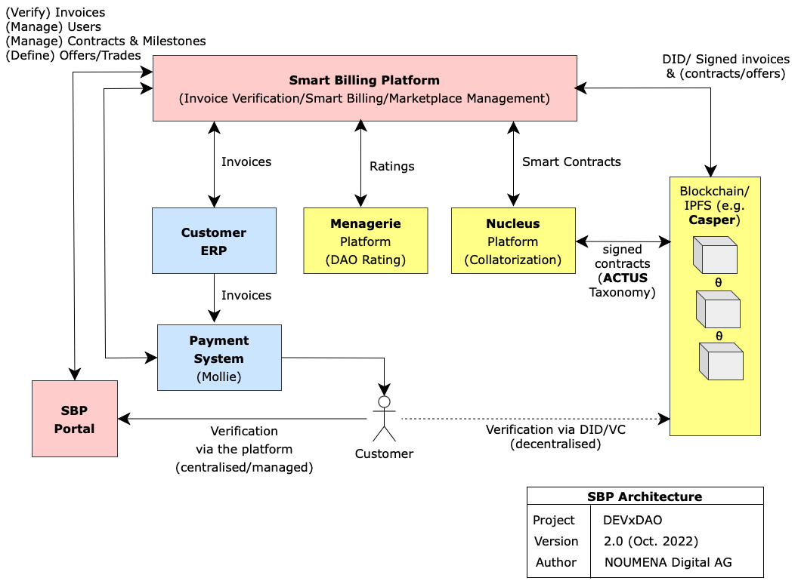
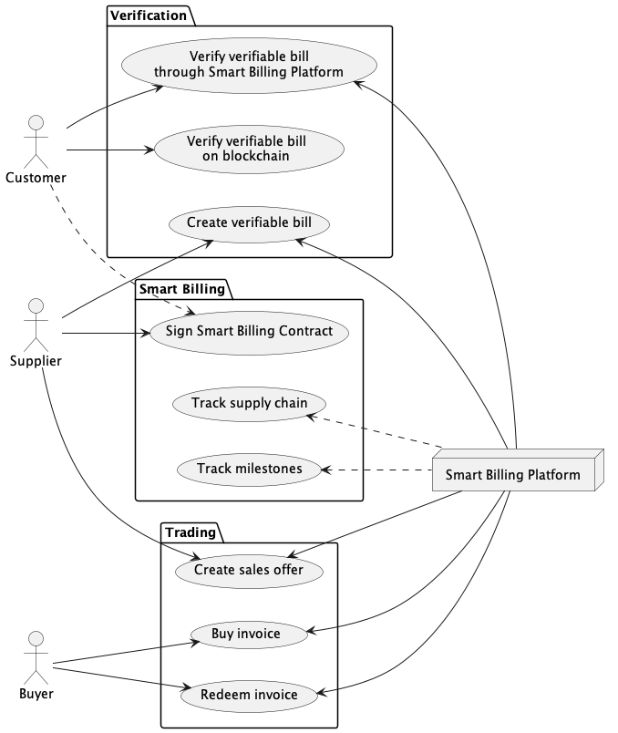
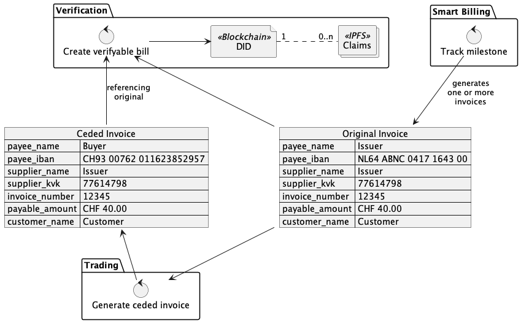
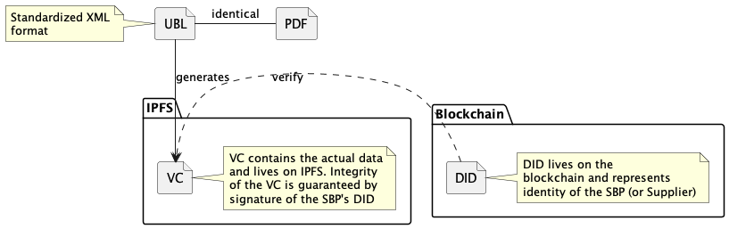

# Smart Billing Platform – Technical Design

This document provides a high-level technical design for the Smart Billing Platform (SBP), supporting the following three
features:

1. Verification – make it possible to verify the origin of an invoice
2. Smart Billing – optimize the billing process in complex supply chain scenarios
3. Trading – allow issuers to sell their invoices, thereby optimizing their cash flow. Including
   - Bill Rating
   - Bill Collatorization

## High-Level Overview



### Parties

This is the list of actors across the various use cases:

| Actor                  | Use Cases | Description                                                                       |
|------------------------|-----------|-----------------------------------------------------------------------------------|
| Smart Billing Platform | All       | Platform for invoice verification; smart billing and marketplace management.      |
| Supplier               | All       | Supplies services and/or goods; responsible for creating the original invoice.    |
| Customer               | All       | Buys services and/or goods; responsible for paying the invoice.                   |
| Casper                 | All       | Blockchain technology.                                                            |
| IPFS                   | All       | File System to store signed invoice records.                                      |
| Mollie                 | All       | Example Payment system for processing invoice payments.                           |
| Buyer                  | Trading   | Buys the right to an invoice from a supplier.                                     |
| Menagerie              | Trading   | Platform to provide a rating of traded invoices (credit risk)                     |
| Nucleus                | Trading   | Finance platform for handling financial instruments using invoices as collateral. |

Actors related to tracking the supply chain are out of scope.



## Invoice

Invoices are the primary artefacts in this system.

A big part of the Smart Billing Platform is about mirroring invoices on decentralized place, making their existence
verifiable by independent parties.

The invoice will have three representations:

1. The _original_ representation, such as the UBL for an invoice.
2. The _NPL_ representation, used for the verification on the platform
3. The _blockchain_ representation, used for the decentralized verification



## Verification

For the decentralized verification we rely on two related existing standards:
**Decentralized Identifiers (DIDs)** and **Verifiable Credentials (VCs)**.

In case of the SBP, the DID provides an online identity of the platform, while the VCs act as representation of the invoice signed by that DID. The DID will be stored
in a blockchain (the DID registry for the Casper blockchain will be created for this purpose), while the actual VCs will be stored on IPFS – so we can limit the amount of data stored on the
blockchain (and thereby minimize the blockchain transaction costs). The SBP functions as a VC generator, allowing the NPL contracts to create and sign VC representations of invoices that can be verified on the chain.

SBP will also be used for the off chain verification.

### Verification Threat Models

When it comes to invoice verification, the Smart Billing Platform prevents the following threats:

* Attacker pretending to be Supplier but providing IBAN owned by Attacker

However, suppliers are manually onboarded and are considered a trusted party. This means that the Smart Billing Platform
does not prevent threats such as:

* Supplier billing a wrong amount
* Supplier billing a wrong customer

### Input Format

For the Smart Billing Platform we only consider invoices in UBL as valid input. The following example shows the bare
minimum.

```xml

<Invoice xmlns:cac="urn:oasis:names:specification:ubl:schema:xsd:CommonAggregateComponents-2"
         xmlns:cbc="urn:oasis:names:specification:ubl:schema:xsd:CommonBasicComponents-2"
         xmlns="urn:oasis:names:specification:ubl:schema:xsd:Invoice-2">
    <cbc:ID>12345</cbc:ID>
    <cbc:IssueDate>2022-11-13</cbc:IssueDate>
    <cac:AccountingSupplierParty>
        <cac:Party>
            <cbc:EndpointID schemeID="0106">77614798</cbc:EndpointID>
            <cac:PartyName>
                <cbc:Name>Supplier BV</cbc:Name>
            </cac:PartyName>
        </cac:Party>
    </cac:AccountingSupplierParty>
    <cac:AccountingCustomerParty>
        <cac:Party>
            <cac:PartyName>
                <cbc:Name>Customer BV</cbc:Name>
            </cac:PartyName>
        </cac:Party>
    </cac:AccountingCustomerParty>
    <cac:PaymentMeans>
        <cac:PayeeFinancialAccount>
            <cbc:ID>NL64ABNC0417164300</cbc:ID>
            <cbc:Name>Supplier BV</cbc:Name>
        </cac:PayeeFinancialAccount>
    </cac:PaymentMeans>
</Invoice>
```

### Data Analysis

The Invoice ID and Supplier Endpoint ID (e.g. KvK-nummer) together uniquely identify an invoice. Combined with the Payee
Financial Account (e.g. IBAN) this provides enough data to protect against the supported threat models. Providing the
Supplier Name helps in visual (i.e. non-automated) validation of an invoice.

While the Customer Name _is_ relevant, it should also be considered Personal Data and as such does not belong on a
blockchain.

The Payee name is only relevant in the context of the Trading use case, where the payee ends up being a different person
from the original supplier.

| UBL Name            | Common Name | Use               |
|---------------------|-------------|-------------------|
| ID                  | Invoice ID  | Unique identifier |
| Supplier EndpointID | Supplier    | Unique identifier |
| Supplier Name       |             |                   |
| FinancialAccountID  | IBAN        | Validation        |
| PayableAmount       | -           | -                 |
| Customer Name       | -           | -                 |

The Invoice ID and Supplier ID together uniquely identify an invoice. When it comes to the goal of Fraud Prevention, the
amount payable and the IBAN must be present as well.



#### Invoice VC

The eventual VC we're talking about looks like this:

```json
{
  "@context": [
    "https://schema.org"
  ],
  "type": "Invoice",
  "identifier": "12345",
  "provider": {
    "identifier": "77614798"
  },
  "paymentMethodID": "NL64ABNC0417164300"
}
```

The terminology here is dictated by the schema.org/Invoice type. The actual VCs are stored as a JWT Payload. In the
following example most signing-related fields are omitted; but the end-result is a JWT signed by the Smart Billing
Platform.

```json
{
  "sub": "did:example:inv-xyz",
  "iss": "https://smart-billing-platform.nl",
  "vc": {
    "@context": [
      "https://schema.org"
    ],
    "type": "Invoice",
    "identifier": "12345",
    "provider": {
      "identifier": "77614798"
    },
    "paymentMethodID": "NL64ABNC0417164300"
  }
}
```

This JWT is stored on IPFS, resulting in an IPFS IRI.

#### DID
The _DID Owner_ is initially the SBP; eventually this could also be the supplier, but that requires a
   public key infrastructure on the supplier's side.

The DID is as simple as possible (to minimize blockchain transaction costs). It contains the typical PKI information
(omitted from the example) and a link
to the corresponding NPL, referred to with the service type `NPL`.

```json
{
  "@context": "https://www.w3.org/ns/did/v1",
  "id": "did:example:sbp-unique-identifier",
  "controller": "did:example:sbp-unique-identifier",
  "services": [
    {
      "id": "did:example:sbp-unique-identifier#npl",
      "type": "NPL",
      "serviceEndpoint": "3120b6bb-5698-439a-902a-0f8dd4484227"
    }
  ]
}
```

* `did:example:sbp-unique-identifier` is the actual DID for the Smart Billing Platform; it's generated by the underlying DID Method which likely is the DID registry on the Casper
  Blockchain.

## Smart Billing

The Smart Billing Contract underlies a set of milestones and ensures that invoices are generated when and only when certain
conditions are met.

Smart Billing Contracts primarily live off-chain (as an NPL Smart Protocol), but can have an on-chain representation
containing the highlights of the contract. Having the SBC represented on the blockchain as well means that
VCs of invoices and SBCs can easily relate to each other.

At the same time, typical high volume updates (such as supply chain metrics) should not be stored on-chain because of
the associated transaction costs. In this case it makes sense to initially store the metrics on the NPL Smart Protocol
and only at the end of the lifetime export these metrics a single claim onto IPFS and Blockchain, resulting in a single blockchain
transaction when the blockchain contract is updated.

## Trading

The Smart Billing Platform will provide a way for invoice trading. Traded invoices will be represented in the blockchain as a tokens with the proof of ownership.

A suggested market price is determined. This is based on the debtor's payment track record (stored in SBP) and comparable recent offerings. This suggestion is presented to the supplier who can choose to accept or override this price.

The rating of suppliers is calculated using a DAO rating obtained through Menagerie's voting engine.

For the PoC the price suggestion will be calculated using a simplified formula as the exact market pricing will be subject to the advanced specification of the marketplace (e.g. limit orders, auctioning) that is in turn subject to customer preferences determined during the piloting phase.

An invoice can be used either in a financial arrangement that allows the Supplier to receive payment in advance, ceding the payment directly to the Buyer of the traded invoice. Or the invoice can be offered as collateral, with its token held on the blockchain as security for a financial instrument defined by the ACTUS taxonomy (and the Nucleus Finance platform).

## External Integrations.....

* Supplier ERP & Payment System
* Casper Blockchain / IPFS
* Menagerie Voting Engine
* Nucleus Finance / ACTUS Taxonomy
* Customer ERP (out of scope)
* Supply chain monitoring systems (out of scope)

## References .....

### Internal References

* [User Journey Diagrams](https://lucid.app/lucidchart/821ee138-9bba-4592-8669-f1e15319fd10/edit?invitationId=inv_0ed24406-5cb8-43c1-9359-808ae85b3078&page=j8XeKOm0Wje4#)
* [User Journey and Glossary](https://docs.google.com/document/d/1uPKr8JBV3FWLUwZbrGA_JIx_JtpV--XuVadQCTteO-o/edit#heading=h.7l4ny6t9kpy9)

### External References

* [Decentralized Identifiers](https://www.w3.org/TR/did-core/)
* [Verifiable Credentials](https://www.w3.org/TR/vc-data-model/)
* [DID and VC](https://dl.acm.org/doi/fullHtml/10.1145/3446983.3446992)
* [PEPPOL UBL Example](https://github.com/OpenPEPPOL/peppol-bis-invoice-3/blob/master/rules/examples/base-example.xml)
* [Menagerie Voting Engine](https://menagerie01.webflow.io/services/menagerie-voting-engine)
* [Nucleus Finance](https://nucleusfinance.com)
* [ACTUS taxonomy](https://www.actusfrf.org/taxonomy)
